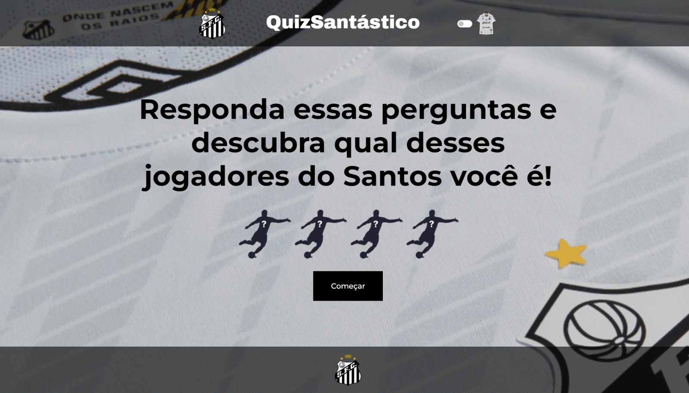
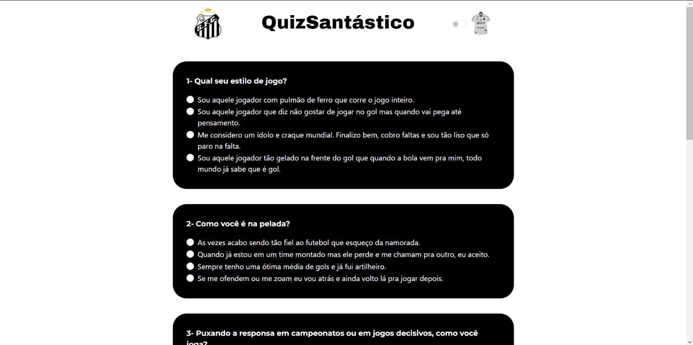

<h1 align="center"> Quiz do Santos FC </h1>

  <a href="#-tecnologias">Tecnologias</a>&nbsp;&nbsp;&nbsp;|&nbsp;&nbsp;&nbsp;
  <a href="#-projeto">Projeto</a>&nbsp;&nbsp;&nbsp;|&nbsp;&nbsp;&nbsp;
  <a href="#memo-licença">Licença</a>

  

 

  
  

## 🚀 Tecnologias

Esse projeto foi desenvolvido com as seguintes tecnologias:

- HTML
- SASS
- JAVASCRIPT
- Git e Github

## 💻 Projeto

Essa site de Quiz foi desenvolvido com o intuito de praticar as minhas habilidades de DOM (Document Object Model) juntamente da lógica de programação com funções, condicionais e repetições com o Javascript.  

 - [Visite o projeto online](https://luishdev.github.io/Quiz-Santos/)

## :memo: Licença

Esse projeto está sob a licença MIT.

---

Feito com ♥ by LuisHdev :wave: [Acesse meu linkedin!](linkedin.com/in/luis-henrique-a5a086250/)
